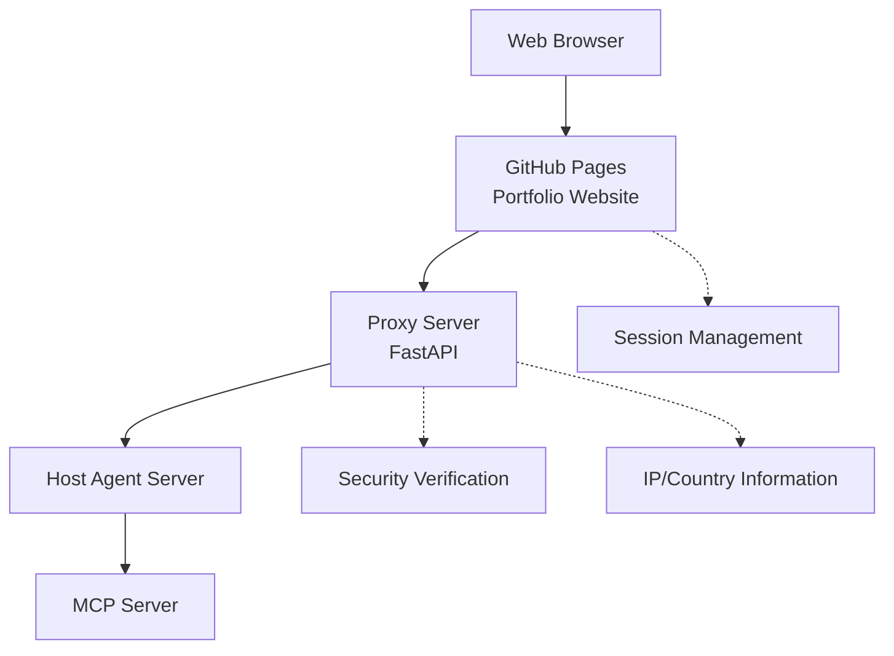

# Kim Donghwi Agent-Based Interactive Portfolio Website

This project is an agent-based interactive portfolio website through a Proxy server. It provides portfolio information through natural language interaction with users and enables real-time communication with AI agents.

## 🏗️ System Architecture

This project uses a microservice architecture consisting of 4 separate repositories:

1. **Website Server (Current Repository)** - Static website through GitHub Pages
2. **Proxy Server** - FastAPI-based intermediate server
3. **Host Agent Server** - Agent hosting server (A2A Protocol)
4. **MCP Server** - Model Context Protocol server (Server & Local)



## 🚀 Key Features

### 1. Real-time AI Agent Conversation
- **POST /agent/chat**: Send user input to Proxy server
- **TaskResponse Return**: Includes `task_id`, `status`, `message`
- **SSE Streaming**: Real-time response through `/agent/chat/stream/{task_id}`
- Natural conversation experience with typing effects

### 2. Agent Status Monitoring
- **GET /agents**: Query connected agent list
- **AgentListResponse**: Status, tools, and description information for each agent
- Real-time status check in the top-right Proxy panel
- Visualization of agent capabilities (tools)

### 3. Security and Session Management
- IP and country information verification at Proxy server
- Input value security check and filtering
- Session-based conversation context maintenance
- Chat history preservation even after refresh

### 4. Responsive UI/UX
- Main page: Full-screen input window
- Sub pages: Floating chat window at bottom-right
- Dark mode toggle support
- Mobile, tablet, desktop optimization

## 📁 File Structure

```
dhkim/
├── README.md                    # Project documentation
├── index.html                   # Main page
├── css/
│   └── style.css               # Main stylesheet
├── js/
│   ├── proxy-api.js            # 🔥 Proxy server API client
│   ├── proxy-status.js         # 🔥 Agent status management
│   ├── main.js                 # Main app logic
│   ├── session-manager.js      # Session management
│   ├── approval-system.js      # Action approval system
│   ├── navigation.js           # Page navigation
│   ├── blog.js                 # Blog functionality
│   ├── gradient.js             # Background effects
│   ├── markdown-loader.js      # Markdown loader
│   └── typing.js               # Typing effects
└── content/
    ├── portfolio.md            # Portfolio content
    ├── resume.md               # Resume content
    └── skills.md               # Skills content
```

## 🔌 API Specification

### Proxy Server Integration API

#### 1. Health Check
```http
GET http://localhost:8000/health
```

#### 2. Query Agent List
```http
GET http://localhost:8000/agents
```
**Response:**
```json
{
  "agents": [
    {
      "id": "agent-001",
      "name": "Portfolio Agent", 
      "description": "Responds to portfolio-related questions",
      "status": "online",
      "capabilities": ["navigate", "content_analysis", "recommendation"]
    }
  ],
  "total": 1
}
```

#### 3. Send User Input
```http
POST http://localhost:8000/agent/chat
Content-Type: application/json

{
  "message": "Show me your portfolio",
  "context": {
    "page": "home",
    "session_id": "session_123",
    "timestamp": 1704067200000
  },
  "user_id": "user_456"
}
```

**Response:**
```json
{
  "task_id": "task_789",
  "status": "queued", 
  "message": "Task added to processing queue"
}
```

#### 4. SSE Streaming
```http
GET http://localhost:8000/agent/chat/stream/{task_id}
```

**SSE Events:**
```javascript
// Status update
data: {"type": "status", "status": "processing", "message": "AI analyzing..."}

// Content streaming  
data: {"type": "content", "content": "Portfolio "}

// Action execution
data: {"type": "action", "action": "navigate", "params": {"page": "portfolio"}}

// Complete
data: {"type": "complete", "metadata": {"processing_time": 2340}}
```

## 🛠️ Development Environment Setup

### 1. Run Local Development Server
```bash
# Python simple server (port 3000)
python -m http.server 3000

# Or Node.js serve
npx serve -p 3000
```

### 2. Proxy Server Connection
- Proxy server must run on `localhost:8000`
- Automatic connection attempt from webpage after server start
- Check connection status with top-right "Proxy" indicator

### 3. Environment Variable Setup
```javascript
// Modify endpoint in js/proxy-api.js
this.baseEndpoint = 'http://localhost:8000'; // Development
// this.baseEndpoint = 'https://api.your-domain.com'; // Production
```

## 🎯 Usage

### 1. Basic Usage
1. Open `index.html` in web browser
2. Check Proxy server connection status (top-right)
3. Enter questions in natural language on main screen
4. Check real-time AI agent responses

### 2. Advanced Features
- **Agent Status Monitoring**: Click "Proxy" at top-right
- **Floating Chat**: Chat icon at bottom-right on sub pages
- **Action Approval**: Approve/reject actions like page navigation
- **Session Continuity**: Maintain conversation history even after refresh

## 🔧 Configuration Files

### Key Configuration Values
```javascript
// Main configuration (js/main.js)
this.apiEndpoint = 'http://localhost:8000/agent/chat';

// Proxy API configuration (js/proxy-api.js) 
this.baseEndpoint = 'http://localhost:8000';

// Timeout settings
const STREAM_TIMEOUT = 60000; // 60 seconds
const POLLING_INTERVAL = 2000; // 2 seconds
```

## 🚢 Deployment Guide

### GitHub Pages Automatic Deployment
1. Push this repository to GitHub
2. Settings → Pages → Source: "Deploy from a branch"
3. Select Branch: `main`, Folder: `/ (root)`
4. Automatically deployed to `https://[username].github.io/dhkim`

### Environment-specific Configuration
```javascript
// Automatic endpoint setting by deployment environment
const isDevelopment = window.location.hostname === 'localhost';
this.baseEndpoint = isDevelopment 
  ? 'http://localhost:8000'
  : 'https://proxy.your-domain.com';
```

## 🧪 Testing

### Manual Test Scenarios
1. **Connection Test**: Check agent status in Proxy panel
2. **Conversation Test**: Enter "Hello" and check response  
3. **Navigation Test**: Enter "Show me your portfolio"
4. **Streaming Test**: Check real-time streaming with long responses
5. **Session Test**: Check chat history preservation after refresh

### Debugging
- Check logs in browser Developer Tools Console
- Monitor API requests/responses in Network tab
- Check status with `window.proxyAPI.getStatus()`

## 🔒 Security Considerations

- **Input Validation**: All user inputs validated at Proxy server
- **CORS Configuration**: API access only from allowed domains
- **Rate Limiting**: Prevent excessive requests
- **Session Security**: Secure session ID generation and management

## 📈 Performance Optimization

- **Lazy Loading**: Dynamic loading of only necessary scripts
- **Caching Strategy**: Leverage browser cache for static resources
- **Compression**: Minimize CSS/JS files
- **CDN**: Consider CDN for global deployment

## 📞 Contact

- **Developer**: Kim Donghwi
- **Email**: [kimdonghwi94@gmail.com]
- **GitHub**: [https://github.com/kimdonghwi94]

---

> **Note**: This website is a prototype of an agent-based interactive portfolio. When the Proxy server is not running, default guidance messages will be displayed.