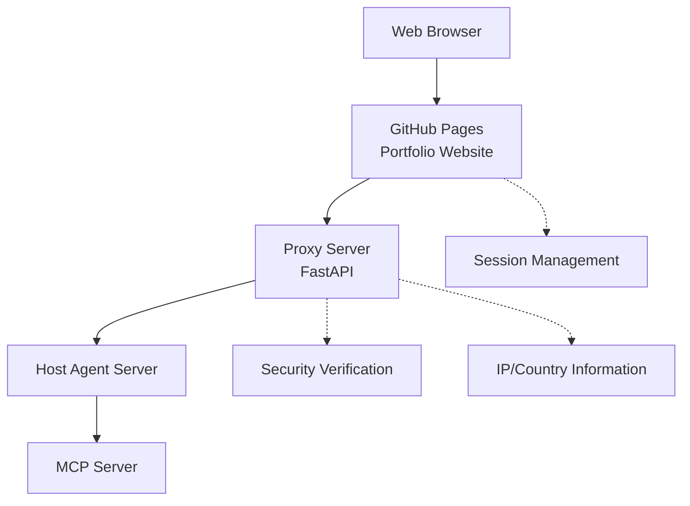

# Kim Donghwi Agent-Based Interactive Portfolio Website

An intelligent portfolio website powered by AI agents that provides personalized portfolio information through natural language conversations. Features real-time agent communication with fallback support and responsive design.

## 🏗️ System Architecture

This project uses a microservice architecture consisting of 4 separate repositories:

1. **Website Server (Current Repository)** - Static website through GitHub Pages
2. **Proxy Server** - FastAPI-based intermediate server
3. **Host Agent Server** - Agent hosting server (A2A Protocol)
4. **MCP Server** - Model Context Protocol server (Server & Local)



## 🚀 Key Features

### 1. Intelligent Agent Communication
- **Real-time Streaming**: Live responses with typing effects via Server-Sent Events
- **Fallback System**: Offline keyword-based responses when server unavailable
- **Session Management**: Persistent conversation context across page refreshes
- **Timeout Protection**: 8-second connection timeout prevents infinite loading

### 2. Agent Status Monitoring
- **Live Status Display**: Real-time agent connection status in top-right panel
- **Agent Capabilities**: View available tools and services for each agent
- **Connection Recovery**: Automatic reconnection attempts with user feedback
- **Expandable Interface**: Collapsible agent details and tool information

### 3. Enhanced User Experience
- **Responsive Design**: Optimized for mobile, tablet, and desktop
- **Dark Mode Support**: Toggle between light and dark themes
- **Accessibility**: Screen reader support with proper ARIA labels and tooltips  
- **Input Validation**: 1000 character limit with proper error handling

### 4. Robust Architecture
- **Microservice Design**: Separate proxy, agent, and MCP server components
- **Security First**: Input sanitization and CORS protection
- **Performance Optimized**: Efficient state management and minimal API calls
- **Error Handling**: Graceful degradation with informative error messages

## 📁 File Structure

```
dhkim/
├── README.md                    # Project documentation
├── index.html                   # Main page
├── css/
│   └── style.css               # Main stylesheet
├── js/
│   ├── proxy-api.js            # 🔥 Optimized Proxy server API client (refactored)
│   ├── proxy-status.js         # 🔥 Agent status management (cleaned up)
│   ├── main.js                 # Main app logic and user interaction
│   ├── session-manager.js      # Session persistence and management
│   ├── approval-system.js      # User action approval system
│   ├── navigation.js           # Page routing and navigation
│   ├── blog.js                 # Blog functionality
│   ├── gradient.js             # Background visual effects
│   ├── markdown-loader.js      # Dynamic markdown content loader
│   └── typing.js               # Realistic typing animation effects
└── content/
    ├── portfolio.md            # Portfolio content
    ├── resume.md               # Resume content
    └── skills.md               # Skills content
```

## 🔌 API Specification

### Proxy Server Integration API

#### 1. Health Check (with timeout protection)
```http
GET http://localhost:8000/api/health
```

#### 2. Query Agent List
```http
GET http://localhost:8000/api/agent/list
```
**Response:**
```json
{
  "agents": [
    {
      "id": "agent-001",
      "name": "Portfolio Agent", 
      "description": "Responds to portfolio-related questions",
      "status": "online",
      "capabilities": ["navigate", "content_analysis", "recommendation"]
    }
  ],
  "total": 1
}
```

#### 3. Send User Input (with 10000 char limit)
```http
POST http://localhost:8000/api/agent/chat
Content-Type: application/json

{
  "message": "Show me your portfolio",
  "context": {
    "page": "home",
    "session_id": "session_123",
    "timestamp": 1704067200000,
    "user_agent": "Mozilla/5.0...",
    "screen_size": "1920x1080",
    "dark_mode": false
  },
  "user_id": "user_456"
}
```

**Response:**
```json
{
  "task_id": "task_789",
  "status": "queued", 
  "message": "Task added to processing queue"
}
```

#### 4. SSE Streaming (with 60s timeout)
```http
GET http://localhost:8000/api/agent/chat/stream/{task_id}
```

**SSE Events:**
```javascript
// Status update
data: {"type": "status", "status": "processing", "message": "AI analyzing..."}

// Content streaming  
data: {"type": "content", "content": "Portfolio "}

// Action execution
data: {"type": "action", "action": "navigate", "params": {"page": "portfolio"}}

// Complete
data: {"type": "complete", "metadata": {"processing_time": 2340}}
```

## 🛠️ Development Environment Setup

### 1. Run Local Development Server
```bash
# Python simple server (port 3000)
python -m http.server 3000

# Or Node.js serve
npx serve -p 3000
```

### 2. Proxy Server Connection
- Current configuration: `192.168.55.21:8000` (update as needed)
- Connection features: 8-second timeout, automatic retry, graceful fallback
- Status monitoring: Real-time connection indicator in top-right panel

### 3. Environment Variable Setup
```javascript
// Current endpoint in js/proxy-api.js (update as needed)
this.baseEndpoint = 'http://192.168.55.21:8000/api'; // Current configuration
// this.baseEndpoint = 'http://localhost:8000/api';     // Local development  
// this.baseEndpoint = 'https://api.your-domain.com';   // Production
```

## 🎯 Usage

### 1. Basic Usage
1. Open `index.html` in web browser
2. Check AI Agent connection status (top-right panel)
3. Enter questions in natural language (1000 char limit)
4. Experience real-time streaming responses with typing effects
5. Automatic fallback to offline mode if server unavailable

### 2. Advanced Features
- **Agent Status Panel**: Click "Agent Server" to view available agents and tools
- **Floating Chat**: Bottom-right chat icon on content pages
- **Action Approval**: Approve/reject navigation and other actions
- **Session Persistence**: Conversation history preserved across refreshes
- **Dark Mode**: Toggle theme with top-left button

## 🔧 Configuration Files

### Key Configuration Values (Updated)
```javascript
// Proxy API configuration (js/proxy-api.js)
this.baseEndpoint = 'http://192.168.55.21:8000/api';

// Timeout settings (optimized)
const HEALTH_CHECK_TIMEOUT = 8000;  // 8 seconds (proxy-api.js)
const CONNECTION_TIMEOUT = 10000;   // 10 seconds (proxy-status.js)  
const STREAM_TIMEOUT = 60000;       // 60 seconds (streaming)

// Input limits
const MAX_MESSAGE_LENGTH = 10000;   // API limit
const MAX_INPUT_LENGTH = 1000;      // UI limit
```

## 🚢 Deployment Guide

### GitHub Pages Automatic Deployment
1. Push this repository to GitHub
2. Settings → Pages → Source: "Deploy from a branch"
3. Select Branch: `main`, Folder: `/ (root)`
4. Automatically deployed to `https://[username].github.io/dhkim`

### Environment-specific Configuration
```javascript
// Automatic endpoint setting by deployment environment
const isDevelopment = window.location.hostname === 'localhost';
this.baseEndpoint = isDevelopment 
  ? 'http://localhost:8000'
  : 'https://proxy.your-domain.com';
```

## 🧪 Testing

### Manual Test Scenarios (Updated)
1. **Connection Test**: Check "Agent Server" panel, test timeout behavior
2. **Fallback Test**: Disable server and verify offline keyword responses
3. **Navigation Test**: Try "포트폴리오를 보여줘" and approve action  
4. **Streaming Test**: Test long conversations, verify 60s timeout
5. **Session Test**: Refresh page and verify conversation persistence
6. **UI Test**: Test dark mode toggle and responsive design

### Debugging (Enhanced)
- Console logs include connection status and error details
- Network tab shows optimized API calls with proper timeouts
- Agent states: `window.proxyAPI.getStatus()` and `window.proxyStatusManager.isConnecting`
- LocalStorage inspection: Check `agent-states` for UI persistence

## 🔒 Security Considerations

- **Input Validation**: All user inputs validated at Proxy server
- **CORS Configuration**: API access only from allowed domains
- **Rate Limiting**: Prevent excessive requests
- **Session Security**: Secure session ID generation and management

## 📈 Performance Optimization (Implemented)

- **Code Refactoring**: Removed duplicate functions and unnecessary API calls
- **Connection Management**: Smart timeout handling prevents infinite loading
- **State Optimization**: Efficient agent state management with localStorage
- **Error Boundaries**: Graceful fallback prevents application crashes
- **Memory Management**: Proper cleanup of event listeners and timeouts

## 📞 Contact

- **Developer**: Kim Donghwi
- **Email**: [kimdonghwi94@gmail.com]
- **GitHub**: [https://github.com/kimdonghwi94]

---

## 🔄 Recent Updates (Latest Refactoring)

- **Cleaned Architecture**: Removed unnecessary server connection functions
- **Enhanced Error Handling**: Added connection timeout protection  
- **Improved UX**: Better loading states and user feedback
- **Code Optimization**: Removed duplicate functions, cleaner codebase
- **Accessibility**: Added tooltips and input limits for better usability

> **Note**: This is an intelligent agent-based portfolio with robust fallback capabilities. The system gracefully handles both online and offline scenarios, providing a seamless user experience regardless of server availability.