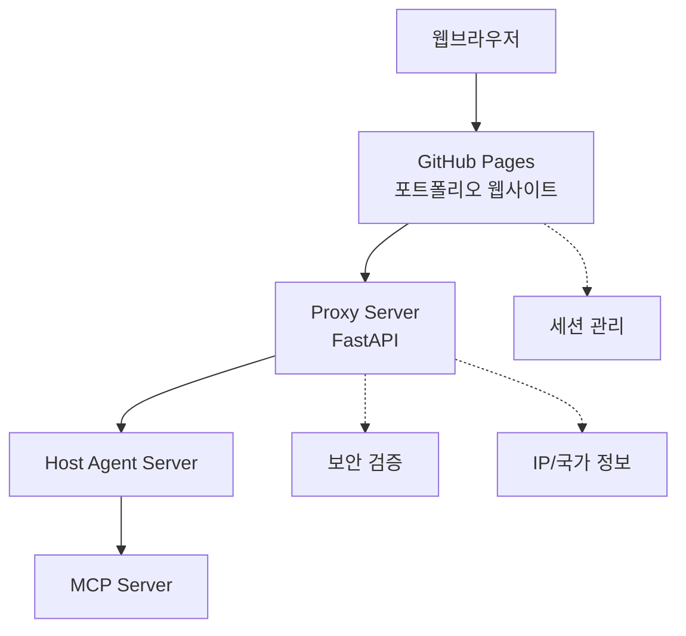

# 김동휘 에이전트 기반 인터랙티브 포트폴리오 웹사이트

이 프로젝트는 Proxy 서버를 통한 에이전트 기반 대화형 포트폴리오 웹사이트입니다. 사용자와의 자연어 상호작용을 통해 포트폴리오 정보를 제공하며, 실시간 AI 에이전트와의 소통이 가능합니다.

## 🏗️ 시스템 아키텍처

이 프로젝트는 4개의 분리된 저장소로 구성된 마이크로서비스 아키텍처를 사용합니다:

1. **웹페이지 Server (현재 저장소)** - GitHub Pages를 통한 정적 웹사이트
2. **Proxy Server** - FastAPI 기반 중간 서버
3. **Host Agent Server** - 에이전트 호스팅 서버 
4. **MCP Server** - Model Context Protocol 서버



## 🚀 주요 기능

### 1. 실시간 AI 에이전트 대화
- **POST /agent/chat**: 사용자 입력을 Proxy 서버로 전송
- **TaskResponse 반환**: `task_id`, `status`, `message` 포함
- **SSE 스트리밍**: `/agent/chat/stream/{task_id}`로 실시간 응답 수신
- 타이핑 효과와 함께 자연스러운 대화 경험

### 2. 에이전트 상태 모니터링
- **GET /agents**: 연결된 에이전트 목록 조회
- **AgentListResponse**: 각 에이전트의 상태, 도구, 설명 정보
- 우상단 Proxy 패널에서 실시간 상태 확인
- 에이전트별 도구(capabilities) 시각화

### 3. 보안 및 세션 관리
- Proxy 서버에서 IP, 국가정보 검증
- 입력값 보안 검사 및 필터링
- 세션 기반 대화 컨텍스트 유지
- 새로고침해도 채팅 기록 보존

### 4. 반응형 UI/UX
- 메인 페이지: 전체 화면 입력창
- 서브 페이지: 우하단 플로팅 채팅창
- 다크모드 토글 지원
- 모바일, 태블릿, 데스크톱 최적화

## 📁 파일 구조

```
dhkim/
├── README.md                    # 프로젝트 문서
├── index.html                   # 메인 페이지
├── css/
│   └── style.css               # 전체 스타일시트
├── js/
│   ├── proxy-api.js            # 🔥 Proxy 서버 API 클라이언트
│   ├── proxy-status.js         # 🔥 에이전트 상태 관리
│   ├── main.js                 # 메인 앱 로직
│   ├── session-manager.js      # 세션 관리
│   ├── approval-system.js      # 액션 승인 시스템
│   ├── navigation.js           # 페이지 네비게이션
│   ├── blog.js                 # 블로그 기능
│   ├── gradient.js             # 배경 효과
│   ├── markdown-loader.js      # 마크다운 로더
│   └── typing.js               # 타이핑 효과
└── content/
    ├── portfolio.md            # 포트폴리오 콘텐츠
    ├── resume.md               # 이력서 콘텐츠
    └── skills.md               # 기술스택 콘텐츠
```

## 🔌 API 명세

### Proxy 서버 연동 API

#### 1. Health Check
```http
GET http://localhost:8000/health
```

#### 2. 에이전트 목록 조회
```http
GET http://localhost:8000/agents
```
**Response:**
```json
{
  "agents": [
    {
      "id": "agent-001",
      "name": "Portfolio Agent", 
      "description": "포트폴리오 관련 질문 응답",
      "status": "online",
      "capabilities": ["navigate", "content_analysis", "recommendation"]
    }
  ],
  "total": 1
}
```

#### 3. 사용자 입력 전송
```http
POST http://localhost:8000/agent/chat
Content-Type: application/json

{
  "message": "포트폴리오를 보여줘",
  "context": {
    "page": "home",
    "session_id": "session_123",
    "timestamp": 1704067200000
  },
  "user_id": "user_456"
}
```

**Response:**
```json
{
  "task_id": "task_789",
  "status": "queued", 
  "message": "Task added to processing queue"
}
```

#### 4. SSE 스트리밍
```http
GET http://localhost:8000/agent/chat/stream/{task_id}
```

**SSE Events:**
```javascript
// 상태 업데이트
data: {"type": "status", "status": "processing", "message": "AI 분석 중..."}

// 콘텐츠 스트리밍  
data: {"type": "content", "content": "포트폴리오 "}

// 액션 실행
data: {"type": "action", "action": "navigate", "params": {"page": "portfolio"}}

// 완료
data: {"type": "complete", "metadata": {"processing_time": 2340}}
```

## 🛠️ 개발 환경 설정

### 1. 로컬 개발 서버 실행
```bash
# Python 간이 서버 (포트 3000)
python -m http.server 3000

# 또는 Node.js serve
npx serve -p 3000
```

### 2. Proxy 서버 연결
- Proxy 서버는 `localhost:8000`에서 실행되어야 함
- 서버 실행 후 웹페이지에서 자동으로 연결 시도
- 우상단 "Proxy" 표시등으로 연결 상태 확인

### 3. 환경 변수 설정
```javascript
// js/proxy-api.js에서 엔드포인트 수정
this.baseEndpoint = 'http://localhost:8000'; // 개발용
// this.baseEndpoint = 'https://api.your-domain.com'; // 배포용
```

## 🎯 사용 방법

### 1. 기본 사용법
1. `index.html`을 웹브라우저에서 열기
2. Proxy 서버 연결 상태 확인 (우상단)
3. 메인 화면에서 자연어로 질문 입력
4. AI 에이전트의 실시간 응답 확인

### 2. 고급 기능
- **에이전트 상태 모니터링**: 우상단 "Proxy" 클릭
- **플로팅 채팅**: 서브 페이지에서 우하단 채팅 아이콘
- **액션 승인**: 페이지 이동 등의 액션에 대한 승인/거부
- **세션 연속성**: 새로고침해도 대화 이력 유지

## 🔧 설정 파일

### 주요 설정값
```javascript
// 메인 설정 (js/main.js)
this.apiEndpoint = 'http://localhost:8000/agent/chat';

// Proxy API 설정 (js/proxy-api.js) 
this.baseEndpoint = 'http://localhost:8000';

// 타임아웃 설정
const STREAM_TIMEOUT = 60000; // 60초
const POLLING_INTERVAL = 2000; // 2초
```

## 🚢 배포 가이드

### GitHub Pages 자동 배포
1. 이 저장소를 GitHub에 Push
2. Settings → Pages → Source: "Deploy from a branch"
3. Branch: `main`, Folder: `/ (root)` 선택
4. 자동으로 `https://[username].github.io/dhkim` 배포

### 환경별 설정
```javascript
// 배포 환경에 따른 엔드포인트 자동 설정
const isDevelopment = window.location.hostname === 'localhost';
this.baseEndpoint = isDevelopment 
  ? 'http://localhost:8000'
  : 'https://proxy.your-domain.com';
```

## 🧪 테스트

### 수동 테스트 시나리오
1. **연결 테스트**: Proxy 패널에서 에이전트 상태 확인
2. **대화 테스트**: "안녕하세요" 입력 후 응답 확인  
3. **네비게이션 테스트**: "포트폴리오를 보여줘" 입력
4. **스트리밍 테스트**: 긴 응답에서 실시간 스트리밍 확인
5. **세션 테스트**: 새로고침 후 채팅 기록 보존 확인

### 디버깅
- 브라우저 개발자 도구 Console에서 로그 확인
- Network 탭에서 API 요청/응답 모니터링
- `window.proxyAPI.getStatus()`로 상태 확인

## 🔒 보안 고려사항

- **입력 검증**: Proxy 서버에서 모든 사용자 입력 검증
- **CORS 설정**: 허용된 도메인에서만 API 접근 가능
- **Rate Limiting**: 과도한 요청 방지
- **세션 보안**: 안전한 세션 ID 생성 및 관리

## 📈 성능 최적화

- **지연 로딩**: 필요한 스크립트만 동적 로딩
- **캐싱 전략**: 정적 리소스 브라우저 캐시 활용
- **압축**: CSS/JS 파일 최소화
- **CDN**: 글로벌 배포 시 CDN 활용 고려

## 🤝 기여 가이드

1. Fork 이 저장소
2. Feature 브랜치 생성: `git checkout -b feature/new-feature`
3. 변경사항 커밋: `git commit -am 'Add new feature'`
4. 브랜치 푸시: `git push origin feature/new-feature`  
5. Pull Request 생성

## 📄 라이선스

이 프로젝트는 MIT 라이선스 하에 배포됩니다.

## 📞 문의사항

- **개발자**: 김동휘
- **이메일**: [your-email@example.com]
- **GitHub**: [https://github.com/kimdonghwi94]

---

> **Note**: 이 웹사이트는 에이전트 기반 대화형 포트폴리오의 프로토타입입니다. Proxy 서버가 실행되지 않은 경우 기본 안내 메시지가 표시됩니다.