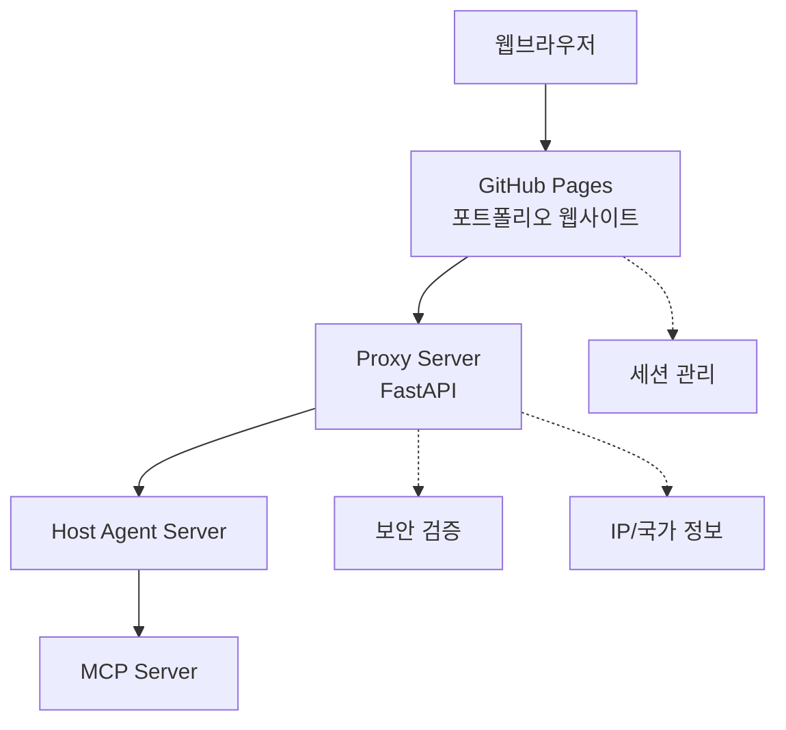

# 김동휘 에이전트 기반 인터랙티브 포트폴리오 웹사이트

AI 에이전트가 제공하는 지능형 포트폴리오 웹사이트입니다. 자연어 대화를 통해 개인화된 포트폴리오 정보를 제공하며, 실시간 에이전트 통신과 폴백 지원, 반응형 디자인을 특징으로 합니다.

## 🏗️ 시스템 아키텍처

이 프로젝트는 4개의 분리된 저장소로 구성된 마이크로서비스 아키텍처를 사용합니다:

1. **웹페이지 Server (현재 저장소)** - GitHub Pages를 통한 정적 웹사이트
2. **Proxy Server** - FastAPI 기반 중간 서버
3. **Host Agent Server** - 에이전트 호스팅 서버 (A2A Protocol)
4. **MCP Server** - Model Context Protocol 서버 (Server & Local)



## 🚀 주요 기능

### 1. 지능형 에이전트 통신
- **실시간 스트리밍**: Server-Sent Events를 통한 타이핑 효과가 있는 실시간 응답
- **폴백 시스템**: 서버 연결 불가 시 오프라인 키워드 기반 응답
- **세션 관리**: 페이지 새로고침 후에도 대화 컨텍스트 유지
- **타임아웃 보호**: 8초 연결 타임아웃으로 무한 로딩 방지

### 2. 에이전트 상태 모니터링
- **실시간 상태 표시**: 우상단 패널에서 에이전트 연결 상태 확인
- **에이전트 기능**: 각 에이전트의 사용 가능한 도구와 서비스 확인
- **연결 복구**: 자동 재연결 시도와 사용자 피드백
- **확장 가능한 인터페이스**: 접을 수 있는 에이전트 상세 정보와 도구 목록

### 3. 향상된 사용자 경험
- **반응형 디자인**: 모바일, 태블릿, 데스크톱에 최적화
- **다크모드 지원**: 라이트/다크 테마 전환
- **접근성**: 스크린 리더 지원과 적절한 ARIA 레이블 및 툴팁
- **입력 검증**: 1000자 제한과 적절한 오류 처리

### 4. 견고한 아키텍처
- **마이크로서비스 설계**: 별도의 프록시, 에이전트, MCP 서버 컴포넌트
- **보안 우선**: 입력 검증 및 CORS 보호
- **성능 최적화**: 효율적인 상태 관리와 최소한의 API 호출
- **오류 처리**: 정보성 오류 메시지와 우아한 성능 저하

## 📁 파일 구조

```
dhkim/
├── README.md                    # 프로젝트 문서
├── index.html                   # 메인 페이지
├── css/
│   └── style.css               # 전체 스타일시트
├── js/
│   ├── proxy-api.js            # 🔥 최적화된 Proxy 서버 API 클라이언트 (리팩토링됨)
│   ├── proxy-status.js         # 🔥 에이전트 상태 관리 (정리됨)
│   ├── main.js                 # 메인 앱 로직 및 사용자 상호작용
│   ├── session-manager.js      # 세션 지속성 및 관리
│   ├── approval-system.js      # 사용자 액션 승인 시스템
│   ├── navigation.js           # 페이지 라우팅 및 네비게이션
│   ├── blog.js                 # 블로그 기능
│   ├── gradient.js             # 배경 시각 효과
│   ├── markdown-loader.js      # 동적 마크다운 콘텐츠 로더
│   └── typing.js               # 실제적인 타이핑 애니메이션 효과
└── content/
    ├── portfolio.md            # 포트폴리오 콘텐츠
    ├── resume.md               # 이력서 콘텐츠
    └── skills.md               # 기술스택 콘텐츠
```

## 🔌 API 명세

### Proxy 서버 연동 API

#### 1. Health Check (타임아웃 보호 기능)
```http
GET http://localhost:8000/api/health
```

#### 2. 에이전트 목록 조회
```http
GET http://localhost:8000/api/agent/list
```
**Response:**
```json
{
  "agents": [
    {
      "id": "agent-001",
      "name": "Portfolio Agent", 
      "description": "포트폴리오 관련 질문 응답",
      "status": "online",
      "capabilities": ["navigate", "content_analysis", "recommendation"]
    }
  ],
  "total": 1
}
```

#### 3. 사용자 입력 전송 (10000자 제한)
```http
POST http://localhost:8000/api/agent/chat
Content-Type: application/json

{
  "message": "포트폴리오를 보여줘",
  "context": {
    "page": "home",
    "session_id": "session_123",
    "timestamp": 1704067200000,
    "user_agent": "Mozilla/5.0...",
    "screen_size": "1920x1080",
    "dark_mode": false
  },
  "user_id": "user_456"
}
```

**Response:**
```json
{
  "task_id": "task_789",
  "status": "queued", 
  "message": "Task added to processing queue"
}
```

#### 4. SSE 스트리밍 (60초 타임아웃)
```http
GET http://localhost:8000/api/agent/chat/stream/{task_id}
```

**SSE Events:**
```javascript
// 상태 업데이트
data: {"type": "status", "status": "processing", "message": "AI 분석 중..."}

// 콘텐츠 스트리밍  
data: {"type": "content", "content": "포트폴리오 "}

// 액션 실행
data: {"type": "action", "action": "navigate", "params": {"page": "portfolio"}}

// 완료
data: {"type": "complete", "metadata": {"processing_time": 2340}}
```

## 🛠️ 개발 환경 설정

### 1. 로컬 개발 서버 실행
```bash
# Python 간이 서버 (포트 3000)
python -m http.server 3000

# 또는 Node.js serve
npx serve -p 3000
```

### 2. Proxy 서버 연결
- 현재 설정: `192.168.55.21:8000` (필요시 업데이트)
- 연결 기능: 8초 타임아웃, 자동 재시도, 우아한 폴백
- 상태 모니터링: 우상단 패널의 실시간 연결 표시기

### 3. 환경 변수 설정
```javascript
// js/proxy-api.js의 현재 엔드포인트 (필요시 업데이트)
this.baseEndpoint = 'http://192.168.55.21:8000/api'; // 현재 설정
// this.baseEndpoint = 'http://localhost:8000/api';     // 로컬 개발
// this.baseEndpoint = 'https://api.your-domain.com';   // 배포용
```

## 🎯 사용 방법

### 1. 기본 사용법
1. `index.html`을 웹브라우저에서 열기
2. AI 에이전트 연결 상태 확인 (우상단 패널)
3. 자연어로 질문 입력 (1000자 제한)
4. 타이핑 효과가 있는 실시간 스트리밍 응답 경험
5. 서버 사용 불가 시 자동 오프라인 모드

### 2. 고급 기능
- **에이전트 상태 패널**: "Agent Connect" 클릭으로 사용 가능한 에이전트와 도구 보기
- **플로팅 채팅**: 콘텐츠 페이지의 우하단 채팅 아이콘
- **액션 승인**: 네비게이션 및 기타 액션에 대한 승인/거부
- **세션 지속성**: 새로고침 후에도 대화 기록 보존
- **다크모드**: 좌상단 버튼으로 테마 전환

## 🔧 설정 파일

### 주요 설정값 (업데이트됨)
```javascript
// Proxy API 설정 (js/proxy-api.js)
this.baseEndpoint = 'http://192.168.55.21:8000/api';

// 타임아웃 설정 (최적화됨)
const HEALTH_CHECK_TIMEOUT = 8000;  // 8초 (proxy-api.js)
const CONNECTION_TIMEOUT = 10000;   // 10초 (proxy-status.js)  
const STREAM_TIMEOUT = 60000;       // 60초 (스트리밍)

// 입력 제한
const MAX_MESSAGE_LENGTH = 10000;   // API 제한
const MAX_INPUT_LENGTH = 1000;      // UI 제한
```

## 🚢 배포 가이드

### GitHub Pages 자동 배포
1. 이 저장소를 GitHub에 Push
2. Settings → Pages → Source: "Deploy from a branch"
3. Branch: `main`, Folder: `/ (root)` 선택
4. 자동으로 `https://[username].github.io/dhkim` 배포

### 환경별 설정
```javascript
// 배포 환경에 따른 엔드포인트 자동 설정
const isDevelopment = window.location.hostname === 'localhost';
this.baseEndpoint = isDevelopment 
  ? 'http://localhost:8000'
  : 'https://proxy.your-domain.com';
```

## 🧪 테스트

### 수동 테스트 시나리오 (업데이트됨)
1. **연결 테스트**: "Agent Connect" 패널에서 타임아웃 동작 테스트
2. **폴백 테스트**: 서버 비활성화 후 오프라인 키워드 응답 확인
3. **네비게이션 테스트**: "포트폴리오를 보여줘" 입력 후 액션 승인
4. **스트리밍 테스트**: 긴 대화에서 60초 타임아웃 확인
5. **세션 테스트**: 페이지 새로고침 후 대화 지속성 확인
6. **UI 테스트**: 다크모드 토글 및 반응형 디자인 테스트

### 디버깅 (향상됨)
- 콘솔 로그에 연결 상태 및 오류 세부사항 포함
- Network 탭에서 적절한 타임아웃이 적용된 최적화된 API 호출 확인
- 에이전트 상태: `window.proxyAPI.getStatus()` 및 `window.proxyStatusManager.isConnecting`
- LocalStorage 검사: UI 지속성을 위한 `agent-states` 확인

## 🔒 보안 고려사항

- **입력 검증**: Proxy 서버에서 모든 사용자 입력 검증
- **CORS 설정**: 허용된 도메인에서만 API 접근 가능
- **Rate Limiting**: 과도한 요청 방지
- **세션 보안**: 안전한 세션 ID 생성 및 관리

## 📈 성능 최적화 (구현됨)

- **코드 리팩토링**: 중복 함수 제거 및 불필요한 API 호출 정리
- **연결 관리**: 스마트 타임아웃 처리로 무한 로딩 방지
- **상태 최적화**: localStorage를 활용한 효율적인 에이전트 상태 관리
- **오류 경계**: 우아한 폴백으로 애플리케이션 충돌 방지
- **메모리 관리**: 이벤트 리스너 및 타임아웃의 적절한 정리

## 📞 문의사항

- **개발자**: 김동휘
- **이메일**: [kimdonghwi94@gmail.com]
- **GitHub**: [https://github.com/kimdonghwi94]

---

## 🔄 최근 업데이트 (최신 리팩토링)

- **정리된 아키텍처**: 불필요한 서버 연결 함수 제거
- **향상된 오류 처리**: 연결 타임아웃 보호 기능 추가
- **개선된 UX**: 더 나은 로딩 상태 및 사용자 피드백
- **코드 최적화**: 중복 함수 제거, 더 깔끔한 코드베이스
- **접근성**: 더 나은 사용성을 위한 툴팁 및 입력 제한 추가

> **Note**: 이것은 견고한 폴백 기능을 갖춘 지능형 에이전트 기반 포트폴리오입니다. 시스템은 온라인과 오프라인 시나리오 모두를 우아하게 처리하여 서버 가용성과 관계없이 원활한 사용자 경험을 제공합니다.